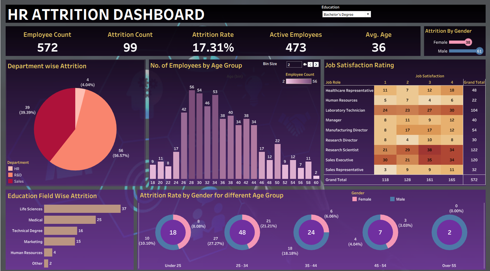

# HR Attrition Dashboard – Tableau Project

## Project Overview
This project is an interactive **HR Attrition Dashboard** created in **Tableau** to analyze employee attrition patterns within an organization.

The dashboard helps HR teams and management understand:

- Employee turnover trends
- Attrition rate across departments
- Gender-wise attrition
- Age group analysis
- Job satisfaction levels
- Education field impact on attrition

The goal of this dashboard is to provide actionable insights that can help organizations improve employee retention and workforce planning.

## Dashboard Preview

## Key KPIs

| KPI | Value |
|------|------|
| Total Employees | 1,470 |
| Attrition Count | 237 |
| Attrition Rate | 16.12% |
| Active Employees | 1,233 |
| Average Age | 37 |

## Features & Insights

### Department-wise Attrition
- Shows attrition distribution across:
  - HR
  - R&D
  - Sales
- Helps identify departments with the highest employee turnover.

### Employee Distribution by Age Group
- Displays the number of employees across different age brackets.
- Useful for workforce demographic analysis.

### Job Satisfaction Rating
- Heatmap visualization showing satisfaction levels across job roles.
- Helps understand employee engagement trends.

### Education Field-wise Attrition
- Identifies which education backgrounds have higher attrition.
- Useful for hiring and retention strategy planning.

### Gender-wise Attrition by Age Group
- Compares attrition trends between male and female employees across age categories.

### Interactive Filters
- Dynamic filtering using:
  - Education filter
- Allows users to customize analysis interactively.

## Tools & Technologies Used

- Tableau
- Data Visualization
- HR Analytics
- Dashboard Design

## Skills Demonstrated

- Data Cleaning
- KPI Analysis
- HR Analytics
- Interactive Dashboard Development
- Data Visualization
- Business Insights Generation

## Business Problem

Employee attrition can lead to:
- Increased hiring costs
- Reduced productivity
- Loss of experienced employees

This dashboard helps management identify:
- High attrition areas
- Employee dissatisfaction patterns
- Demographic trends influencing turnover

## Conclusion

The HR Attrition Dashboard provides a comprehensive view of workforce attrition trends and helps HR departments make data-driven decisions to improve employee retention and organizational performance.

